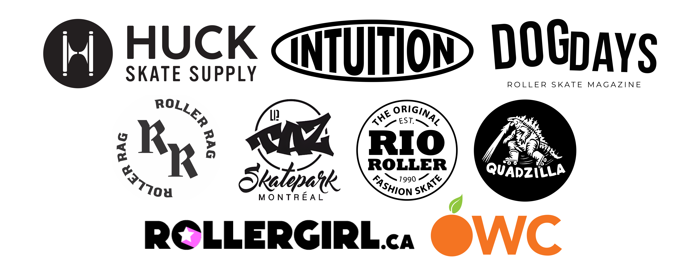

+++
+++

    

         Co-organizers 
    
    

    

         Co-organizers 
    
        

	
  
 
    
  

    

         Main Sponsors 
    
    

    

         Main Sponsors 
    
        

	
   

    
  

    
  

	
   

	
   

    
   

    
   

    

         Sponsoring Partners 
    
    

    

         Sponsoring Partners 
    
        

    

         Partners 
    
    

    

         Partners 
    
        

